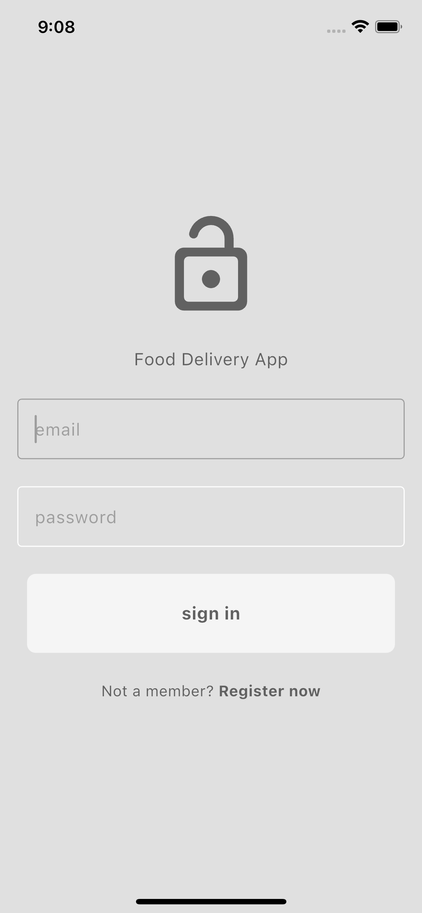
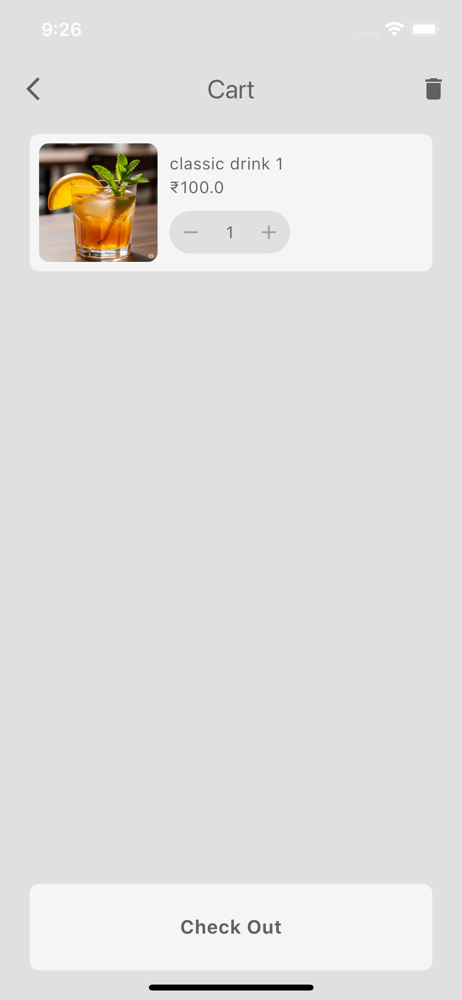
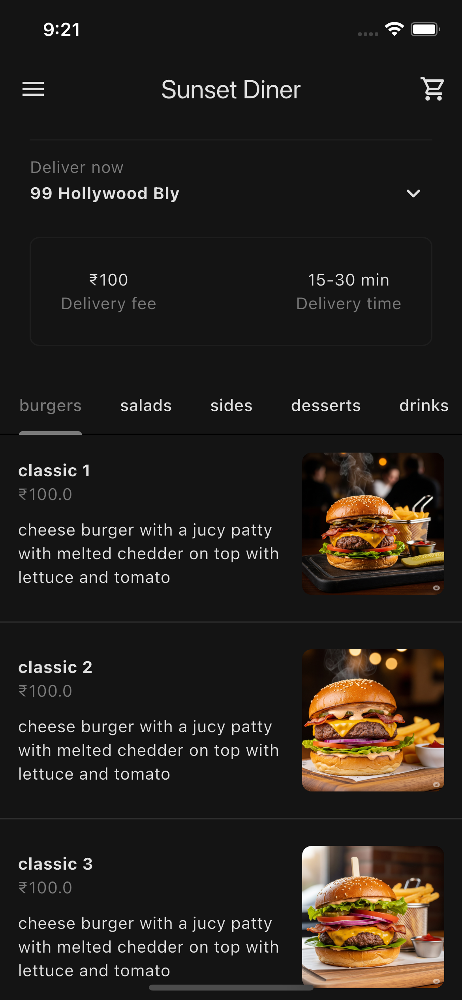
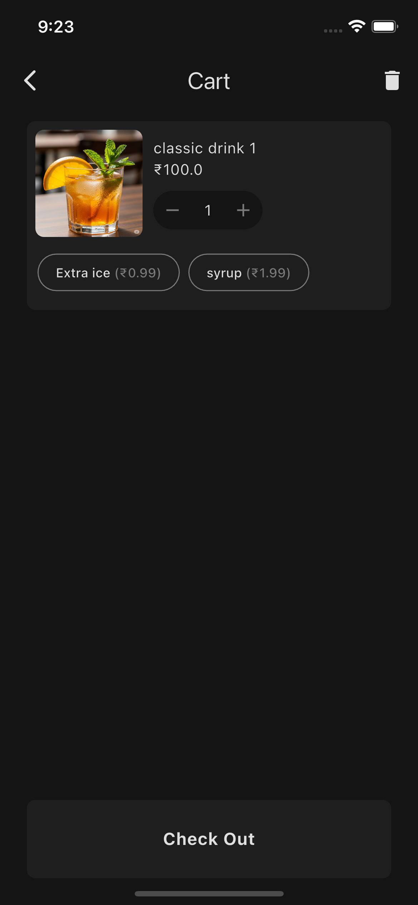

# Food_Delivery_App

A Flutter + Firebase based food delivery app for restaurants — allowing customers to browse menu, place orders, and restaurants to manage orders & items through a mobile app.

## 🚀 Table of Contents

* [About](#about)
* [Features](#features)
* [Screenshots](#screenshots)
* [Tech Stack](#tech-stack)
* [Getting Started](#getting-started)

  * [Prerequisites](#prerequisites)
  * [Installation & Setup](#installation--setup)
* [Project Structure](#project-structure)
* [Usage](#usage)
* [Contributing](#contributing)
* [Future Work](#future-work)

## 🔎 About

This is a full-featured Food Delivery Application built with Flutter and Firebase, intended for restaurants to enable customers to browse menu items, add to cart, place orders — and for restaurants/admins to manage items and orders.
It aims to provide a simple, intuitive, and responsive mobile-first solution for food ordering and delivery management.

## ✅ Features

* Browse menu / list of food items
* Add to cart, manage cart (update quantity, remove items)
* Place orders
* User authentication (login/signup) via Firebase
* Admin/Restaurant side: manage products, manage orders
* Push ordering / real-time updates (depending on Firebase configuration)
* Clean UI built in Flutter for both Android and iOS














## 📸 Screenshots
### 🔐 Login


### 🍽️ Menu (Light Mode)


	
### 🧾 Orders & Cart (Light Mode)


	
	
### 🌙 Menu (Dark Mode)


	
### 🌙 Orders & Cart (Dark Mode)


	
	

## 🛠 Tech Stack

* Frontend / App: Flutter (Dart) — supports Android & iOS
* Backend / Backend-as-Service: Firebase (Firestore / Realtime DB / Auth / etc.)
* Project dependencies / config managed via `pubspec.yaml`

## 🧑‍💻 Getting Started

### Prerequisites

Make sure you have installed:

* Flutter SDK (with required environment for Android and/or iOS)
* A Firebase project (Firestore / Auth set up)
* A code editor (e.g. VS Code / Android Studio)

### Installation & Setup

```bash
# Clone the repo  
git clone https://github.com/shashwat-raj-420/Food_Delivery_App.git  
cd Food_Delivery_App  

# Install dependencies  
flutter pub get  

# Configure Firebase  
# — Update `firebase.json` / Firebase config in the project as per your Firebase project  
# — Ensure authentication / database rules (as needed)  

# Run the app  
flutter run  
```

For building release versions (Android .apk / iOS), follow standard Flutter build commands.

## 📁 Project Structure

```
Food_Delivery_App/
├── android/          # Android platform-specific code
├── ios/              # iOS platform-specific code
├── lib/              # Main Dart/Flutter source files
├── test/             # Unit / widget tests (if any)
├── pubspec.yaml      # Dependencies, metadata
├── firebase.json     # Firebase configuration / settings
└── README.md         # ← this file
```

## 🎯 Usage

* On first run, sign up / login as a user (or restaurant / admin if configured)
* Browse available food items / menu
* Add items to cart, view cart, update quantity or remove items
* Place order — orders will be stored in Firebase backend
* Admin/restaurant users can log in via admin credentials to manage items and orders

## 🤝 Contributing

Contributions are welcome! 🙂
If you’d like to contribute:

1. Fork the repository
2. Create a new branch (`git checkout -b feature/YourFeatureName`)
3. Make your changes & commit (`git commit -m 'Add some feature'`)
4. Push to the branch (`git push origin feature/YourFeatureName`)
5. Open a Pull Request describing your changes

Please follow consistent coding style and add comments where necessary.

## 🧩 Future Work

* UI enhancements 
* Payment integration (e.g. using Stripe / Razorpay)
* Order status tracking (preparing, out for delivery, delivered)
* User profile & order history
* Push notifications for order updates


